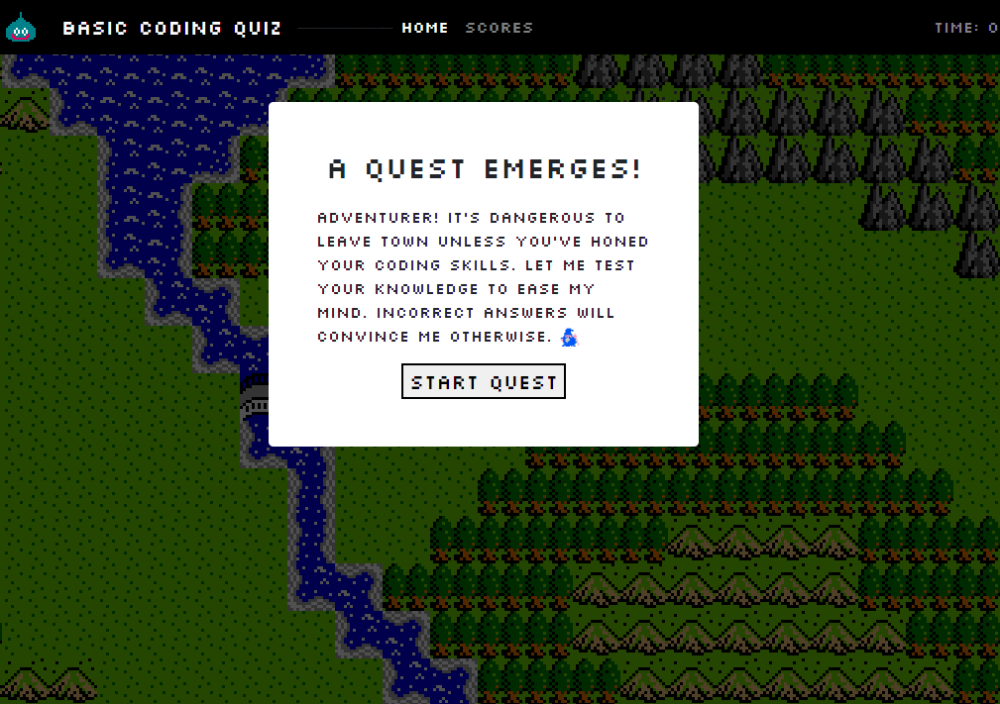
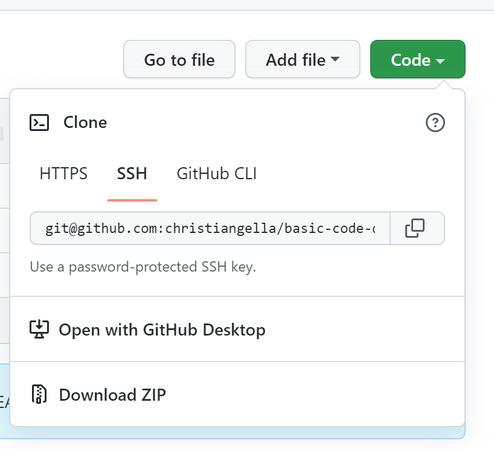

# basic-code-quiz

## Description

This repository was built for the UC Davis Full Stacks Coding Bootcamp. The repository is a coding quiz in the style of Dragon Warrior and JRPG aesthetics.

## Features

The repository focuses on Javascript code to build the function and logic for the quiz, and includes the following features:

### General

* Semantic elements for use of accessibility.
* HTML IDs that connect to CSS and Javascript functions and elements.
* Media query and flexboxes for various resolution and devices.
* Guided comments for navigation of HTML, CSS, and Javascript structure.
* Use of Bootstrap features, including a navbar and container.

### Javascript-specific

* Variables that store questions, reference HTML IDs, and establish parameters.
* Appends IDs and elements on the HTML page, and removes/add classes.
* References the array of questions and publishes it to the page.
* Integrates a timer as the primary mode of recording a score.

* Code will prompt user to try again if input does not match established parameters.
* Selectable criterion for inclusion in string generation.
* Personality, because machines should unionize as well.
* Gives audio and written feedback for correct and incorrect answers.

## Installation

Clone a copy of the repository by going to the repo code and selecting Code. In the drop-down menu, select the method of cloning. To copy directly into the terminal, type `git pull` with the SSH key on the .git file to clone locally.

* HTTPS: `https://github.com/christiangella/basic-code-quiz.git`
* SSH: `git@github.com:christiangella/basic-code-quiz.git`

## Deployment

The website can be previewed at the following link: https://christiangella.github.io/basic-code-quiz/

## Future Iterations

The website could expand to incorporate the following features:

* Bugfix the localStorage feature, as the website is currently unable to store saved scores and names.

## Credits

This repository was developed for the UC Davis Fullstacks Bootcamp under the UC Davis Continuing and Professional Education. Media assets, including the background, slime, wizard, and sound effects are ripped from ドラゴンクエスト (Dragon Warrior), localized as Dragon Warrior developed by Chunsoft and developed by Enix.
